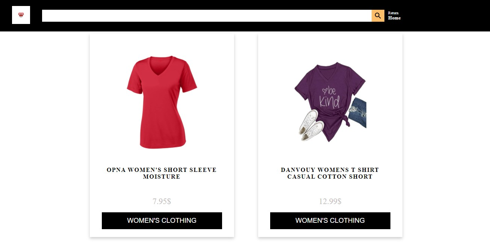

# Z-store

This project consisted of building Store app  using React JavaScript library.

## Screenshots



## Built With 🔨
- JavaScript
- React
- Redux
- CSS


## Live Demo 🚀
[Z-store](https://raza-store.herokuapp.com/)

## Getting Started 💻

## Installation

To get a local copy of the repository please run the following commands on your terminal:

```
$ cd <folder>
```

```
$ git clone git@github.com:rahalrazika/React-capstone.git
```

## Testing 
Below shows the following commands you will need to run tests:
1- Install Jest using yarn: 
```
yarn add --dev jest

```
- or npm :
```
npm install --save-dev jest

```
2- Or just run  
```
npm install

```
to initialize the project

3- To run the tests, execute
```
npm run test 

```
or 
```
yarn test 

```
## Author

👤 **Razika Rahal**

- Github: [@rahalrazika](https://github.com/rahalrazika)
- Linkedin : [Razika Rahal](https://www.linkedin.com/in/razika-rahal-85539bbb/)
- Twitter: [@Razika Rahal](https://twitter.com/RahalRazika)


## 🤝 Contributing

Contributions, issues and feature requests are welcome!

## Show your support

Give a ⭐️ if you like this project!

## Acknowledgments
- Catalogue of Dog Clothes 
-  Odin projects
-  Microverse
-  [Fake Store Api](https://fakestoreapi.com/)